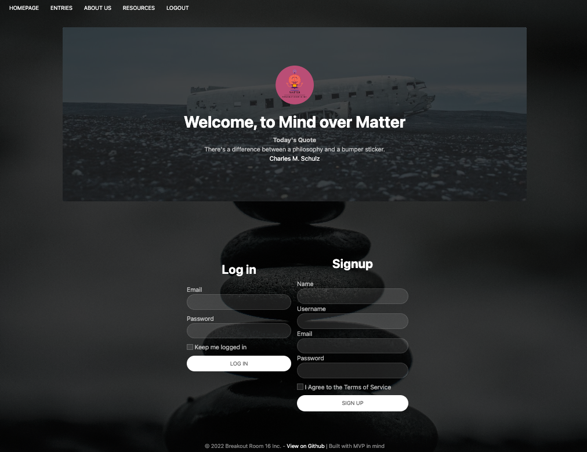
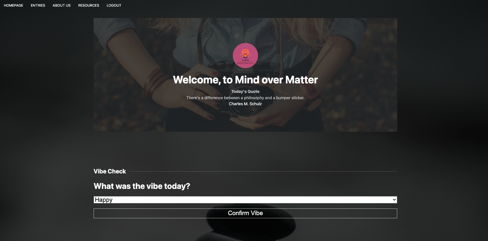
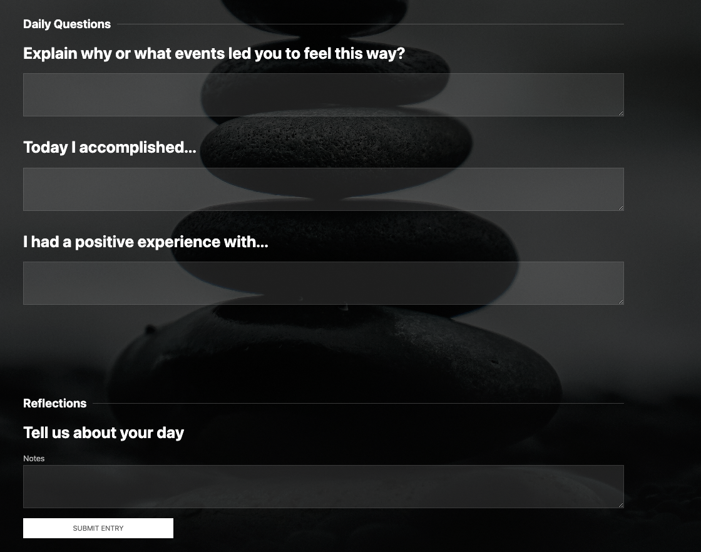
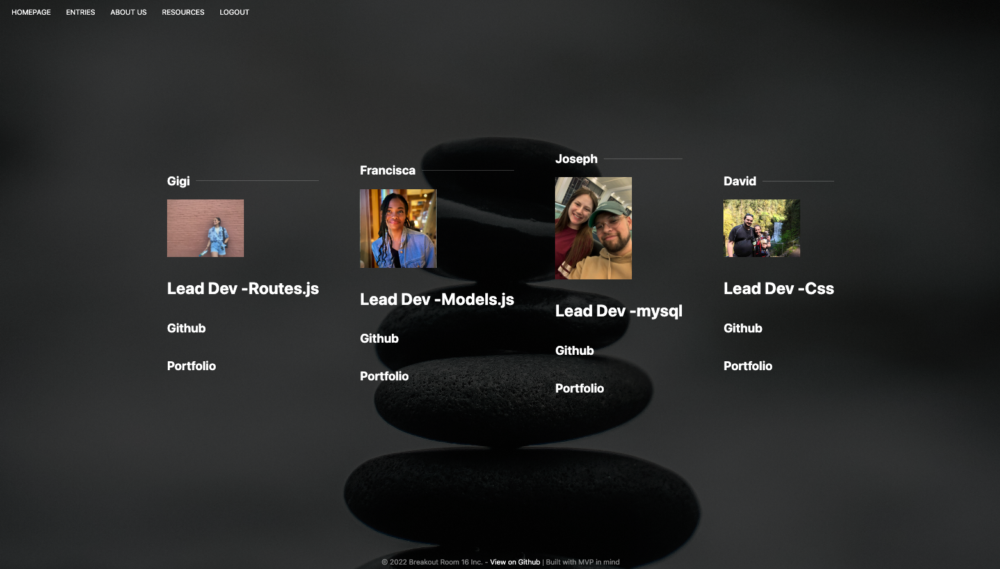
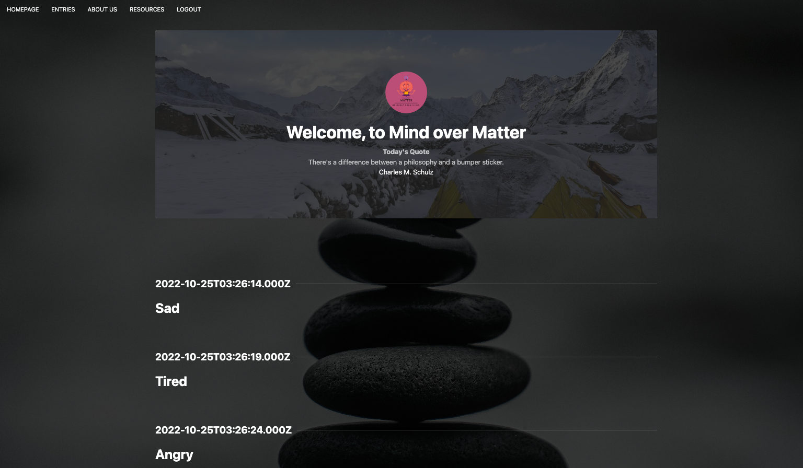
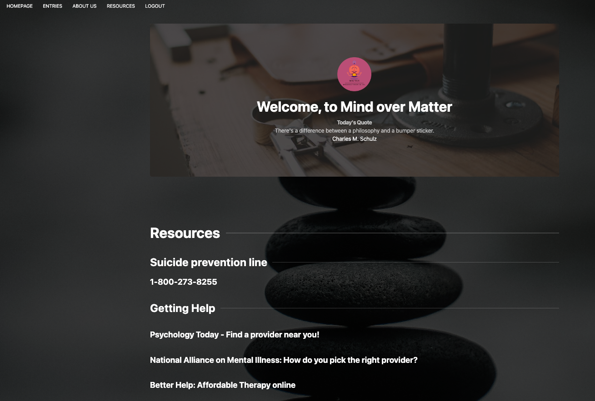

# Mind-Over-Matter

## Description

What is this application? 
* Mental health and wellness tracking application. Includes mental health resources, a daily tracker and prompts you can use to log entries associated with moods for that moment. 

Why did we create this application?
* We created this application for consumers/users who want to be on top of and track their own mental health. We wanted to have a place where you can keep a journal of your thoughts and emotions and keep track of your own personal wellbeing and stay organized. In this bootcamp we all know how important it is to stay organized and on top of things while also maintaining self care and personal time. 

User Story
* AS A USER i want an application THAT includes a daily tracker for my mental health and wellness via mood and journal entries AND provides me with any resources I may need access to including how to find a provider and, who to call in a mental health crisis in my area. 

## Table of Contents

- [Usage](#usage)
- [Built With](#Builtwith)
- [Assets](#Assets)
- [Deployed Application](#installation)
- [Contributors](#contributors)

## Criteria

* Must have a login, Sign up and logout funtionality
* Must be able to log a mood and time stamp 

* Must use Node.js and Express.js to create a RESTful API. 
* Must use Handlebars.js as the template engine. 
* Must use MySQL and the Sequelize ORM for the database.
* Must have both GET and POST routes for retrieving and adding new data.
* Must use at least one new library, package, or technology that we haven’t discussed.
* Must have a folder structure that meets the MVC paradigm.
* Must include authentication (express-session and cookies).
* Must protect API keys and sensitive information with environment variables.
* Must be deployed using Heroku (with data). 
* Must have a polished UI. 
* Must be responsive 
* Must be interactive (i.e., accept and respond to user input).
* Must meet good-quality coding standards (file structure, best practices, etc.).
* Must have a professional README (unique name, description, link to the deployed app).

## Usage

### Screenshots 
* Login and Signup Page

* Homepage: Top of the page

* Homepage: Bottom of the page

* About Us Page 

* Entries page

* Resources page

 
## Built With 

* JavaScript
* HTML
* CSS 
* Node.js
* Node Package Manager
* NPM Inquirer
* Express.js
* Handlebars.js
* Handlebars-express

### Assets 

* UIkit
* Heroku
* postman/insomnia
* MySQLWorkbench

## Deployed Application

This site was built using [Github Respository](https://github.com/francisca-hernandez/Mind-Over-Matter) & deployed using [Heroku](https://mind-over-matter-2.herokuapp.com/)

## Contributers

* Gigi DeBortoli
* Francisca Hernandez
* Joseph Hernandez
* David Ricksgers

## Features

If your project has a lot of features, list them here.

